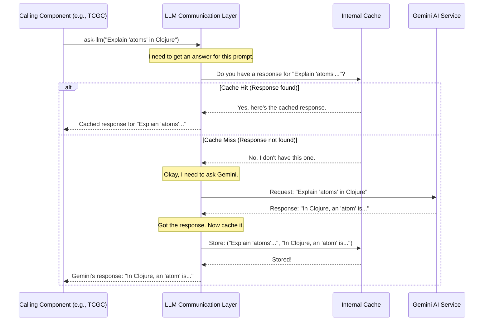

# Chapter 6: LLM Communication Layer

Welcome to the final chapter in our initial journey through `tutorial-clj`! In [Chapter 5: Tutorial Assembler](05_tutorial_assembler.md), we saw how our system takes all the written content and neatly packages it into a complete, structured tutorial. Throughout this series, we've mentioned that components like the [Abstraction Discovery Engine](03_abstraction_discovery_engine.md) and the [Tutorial Content Generation Core](04_tutorial_content_generation_core.md) use "AI magic" to perform their tasks. But how do they actually talk to this powerful AI?

That's where our star for this chapter comes in: the **LLM Communication Layer**.

## What's the Problem? Talking to a Super Smart AI

Imagine you have a friend who is an incredibly knowledgeable expert living far away – let's call this expert "Gemini AI." Gemini can analyze complex information, write human-like text, and understand intricate patterns in code. Several parts of our `tutorial-clj` system need to ask Gemini for help:
*   The [Abstraction Discovery Engine](03_abstraction_discovery_engine.md) needs to ask: "Gemini, look at this code and tell me the main ideas."
*   The [Tutorial Content Generation Core](04_tutorial_content_generation_core.md) needs to ask: "Gemini, please write a beginner-friendly chapter about this specific idea."

But talking to such a powerful AI isn't like a regular chat. You need to:
1.  Format your questions (called "prompts") in a way Gemini understands perfectly.
2.  Send these questions over the internet to Gemini's special address.
3.  Receive Gemini's answers and make sense of them.
4.  And what if you ask the same question multiple times? It would be slow and wasteful to bother Gemini every single time.

We need a dedicated specialist to handle all these communication details smoothly and efficiently.

## Meet the Messenger: The LLM Communication Layer

The **LLM Communication Layer** is precisely this specialist. Think of it as the dedicated, highly efficient messenger service for our `tutorial-clj` system to communicate with the Gemini AI.

Its main responsibilities are:
*   **Taking Requests:** When another part of our system (like the [Tutorial Content Generation Core](04_tutorial_content_generation_core.md)) has a task for Gemini, it gives the request to the LLM Communication Layer.
*   **Formatting for Gemini:** This layer knows exactly how Gemini AI likes its requests structured. It takes the task and formats it into a perfect "prompt."
*   **Sending the Message:** It sends this formatted prompt over the internet to Gemini AI.
*   **Receiving and Processing the Reply:** When Gemini AI responds, this layer receives the answer, perhaps does a little cleanup if needed, and then passes it back to the component that originally asked.
*   **Smart Memory (Caching):** This is a clever trick! If we've asked Gemini the exact same question recently, the LLM Communication Layer remembers the previous answer (caches it) and gives it back immediately without bothering Gemini again. This saves time and resources (like asking Gemini less often, which can sometimes cost money or have usage limits).

So, if the [Tutorial Content Generation Core](04_tutorial_content_generation_core.md) wants to ask Gemini to write about "User Authentication," it doesn't talk to Gemini directly. It just tells the LLM Communication Layer, "Hey, ask Gemini to write about 'User Authentication' with these details." The LLM Communication Layer handles all the nitty-gritty of the conversation.

## Key Features of Our Messenger

Let's break down the important jobs of the LLM Communication Layer:

1.  **Prompt Engineering (Preparing the Question):**
    *   The layer might help refine the questions (prompts) sent to the LLM to get better answers. For now, we'll assume it mainly focuses on packaging and sending prompts given to it.

2.  **Interfacing with the LLM (Sending & Receiving):**
    *   This involves the technical details of making a web request to the Gemini AI's service (API), sending the prompt, and getting the response. This part is like knowing the AI's "phone number" and how to speak its "language."

3.  **Response Handling:**
    *   The AI's raw response might need some minor adjustments or extraction of the core information.

4.  **Caching (The Smart Memory):**
    *   **Why Cache?** LLMs can be slow to respond, and using them frequently can be expensive or rate-limited. If we ask the *same question* multiple times, it's much faster and cheaper to reuse the *same answer* we got before.
    *   **How it Works (Simply):** The LLM Communication Layer can keep a temporary list of questions it recently asked Gemini and the answers it got. Before sending a new question to Gemini, it first checks its list: "Have I asked this exact question before?"
        *   If YES: Great! It just pulls the answer from its memory (the cache) and returns it instantly.
        *   If NO: Okay, it sends the question to Gemini, gets the answer, *adds this new question-answer pair to its memory for next time*, and then returns the answer.

## How Does It Work? A Day in the Life of the Messenger

Let's imagine the [Tutorial Content Generation Core](04_tutorial_content_generation_core.md) (TCGC) needs help from Gemini.

1.  **TCGC to LLM Comm Layer:** "I need you to ask Gemini the following: 'Write a simple explanation of Clojure's `map` function for a beginner.'"
2.  **LLM Comm Layer (Checks Cache):** "Let me see... have I asked 'Write a simple explanation of Clojure's `map` function for a beginner' recently?"
    *   **Scenario A (Cache Miss - Not in memory):** "Nope, new question!"
        1.  **LLM Comm Layer (Formats & Sends):** It prepares this question in the format Gemini expects and sends it to Gemini AI.
        2.  **Gemini AI (Thinks & Responds):** Gemini processes the request and sends back an explanation.
        3.  **LLM Comm Layer (Receives & Stores):** It gets Gemini's answer (e.g., "The `map` function in Clojure applies another function to every item in a list..."). It then stores both the question and this answer in its cache.
        4.  **LLM Comm Layer to TCGC:** "Here's Gemini's explanation: 'The `map` function...'"
    *   **Scenario B (Cache Hit - Found in memory):** "Yes! I asked this 5 minutes ago and Gemini said 'The `map` function...'"
        1.  **LLM Comm Layer to TCGC:** (Instantly) "Here's Gemini's explanation: 'The `map` function...'" (No need to contact Gemini AI this time!)

**Example Input and Output (Conceptual):**

*   **Input to the LLM Communication Layer's main function (e.g., `ask-llm`):**
    A string containing the prompt:
    ```
    "Explain the concept of 'atoms' in Clojure in one paragraph for a beginner."
    ```
*   **Output from `ask-llm` (after it interacts with Gemini or its cache):**
    A string containing Gemini's response:
    ```
    "In Clojure, an 'atom' is like a special box that holds a value. It's designed for situations where you need to manage state that can change over time, but in a safe way, especially when multiple parts of your program might try to change it at once. You change the value in an atom using functions like `reset!` or `swap!`."
    ```

## Under the Hood: The Messenger's Operations

Let's visualize the process when a component needs the LLM's help, including the caching step.


This diagram clearly shows the "check cache first" logic, which is key to the LLM Communication Layer's efficiency.

## A Glimpse at the Code (Simplified)

Let's look at some conceptual Clojure code to see how this layer might be built. We'll keep it very simple.

**1. Setting up our Namespace and Cache**

First, we define our namespace. For caching, we'll use a simple Clojure `atom` holding a map. An atom is a way to manage shared, changeable data safely.

```clojure
(ns tutorial-clj.llm-communication-layer
  (:require [clojure.string :as str])) ; We might need string functions

;; Our simple in-memory cache: an atom holding a map.
;; The map will store prompts (strings) as keys and responses (strings) as values.
(defonce llm-cache (atom {}))
```
**Explanation:**
*   `ns tutorial-clj.llm-communication-layer`: Declares our namespace.
*   `(defonce llm-cache (atom {}))`: This creates our cache.
    *   `defonce` means this variable (`llm-cache`) is defined only once, even if the code is reloaded. This is good for a cache, so it doesn't get emptied every time we make a small code change.
    *   `(atom {})` creates an atom initialized with an empty map `{}`. This map will store our cached prompts and responses.

**2. Functions to Interact with the Cache**

We need functions to get data from the cache and add data to it.

```clojure
(defn get-from-cache
  "Retrieves a response from the cache for a given prompt, if it exists."
  [prompt]
  (get @llm-cache prompt)) ; @llm-cache "dereferences" the atom to get the map

(defn add-to-cache
  "Adds a prompt and its response to the cache."
  [prompt response]
  (swap! llm-cache assoc prompt response) ; `swap!` safely updates the atom
  response) ; Return the response for convenience
```
**Explanation:**
*   `get-from-cache [prompt]`:
    *   `@llm-cache`: This is how you get the current value *inside* an atom (in our case, the map of cached items).
    *   `(get @llm-cache prompt)`: This looks up the `prompt` in our cache map. If found, it returns the stored response; otherwise, it returns `nil`.
*   `add-to-cache [prompt response]`:
    *   `swap! llm-cache assoc prompt response`: This is the safe way to change the value inside an atom.
        *   `swap!` takes the atom (`llm-cache`), a function to apply (`assoc`), and arguments for that function (`prompt` and `response`).
        *   `assoc` is a Clojure function that adds or updates a key-value pair in a map. So, `(assoc current-cache-map prompt response)` returns a *new* map with the prompt and response added/updated.
        *   `swap!` ensures this update happens correctly, even if multiple parts of a program try to update the cache at the same time (though less of a concern in our simple `tutorial-clj` so far).

**3. Mocking the Actual Call to Gemini AI**

Actually calling an external AI service like Gemini involves network requests, authentication, and handling potential errors. This is complex! For our beginner-friendly tutorial, we'll "mock" this part. This means we'll create a fake function that just pretends to talk to Gemini.

```clojure
(defn- call-gemini-api
  "MOCK FUNCTION: Simulates calling the Gemini AI API.
  In a real system, this would make an HTTP request."
  [prompt]
  (println (str "LLM_CL: (Simulating call to Gemini AI with prompt: \"" 
                (subs prompt 0 (min 50 (count prompt))) "...\")"))
  (Thread/sleep 1000) ; Simulate network delay
  
  ;; Let's return a generic-ish response based on the prompt
  (cond
    (str/includes? (str/lower-case prompt) "abstraction")
    "Gemini says: Based on the input, the key abstractions are X, Y, and Z."
    
    (str/includes? (str/lower-case prompt) "explain")
    (str "Gemini explains: " (str/replace prompt #"explain " "" :ignore-case) " is a very interesting concept...")
    
    :else 
    "Gemini says: I have processed your request. Here is some generated text."))
```
**Explanation:**
*   `call-gemini-api [prompt]`: This is our *fake* function.
*   It prints a message saying it's *simulating* the call.
*   `(Thread/sleep 1000)`: Pauses for 1 second (1000 milliseconds) to pretend it took time to talk to the AI over the internet.
*   The `cond` (conditional) part just returns a slightly different canned response depending on keywords in the prompt. This makes our simulation a tiny bit more dynamic.
*   **Important:** In a real `tutorial-clj` system, this function would contain actual code using an HTTP client library to send `prompt` to the real Gemini AI service and return its true response.

**4. The Main Public Function: `ask-llm`**

This is the function that other components of `tutorial-clj` will use. It brings together the caching logic and the (mocked) AI call.

```clojure
(defn ask-llm
  "Asks the LLM (via cache or direct call) a question (prompt).
  Returns the LLM's response as a string."
  [prompt]
  (if-let [cached-response (get-from-cache prompt)]
    (do
      (println "LLM_CL: Cache HIT!")
      cached-response) ; Return response from cache
    (do
      (println "LLM_CL: Cache MISS. Calling Gemini AI...")
      (let [actual-response (call-gemini-api prompt)]
        (add-to-cache prompt actual-response) ; Add to cache for next time
        actual-response)))) ; Return fresh response
```
**Explanation:**
*   `ask-llm [prompt]`: This is the primary function our LLM Communication Layer offers.
*   `(if-let [cached-response (get-from-cache prompt)] ...)`:
    *   This first tries to get a response from the cache using `get-from-cache`.
    *   `if-let` is a handy Clojure form. If `(get-from-cache prompt)` returns something "truthy" (not `nil` or `false`), it binds that value to `cached-response` and executes the first block (the "then" part).
*   **Cache Hit:** If `cached-response` is found:
    *   It prints "Cache HIT!"
    *   It returns `cached-response` immediately.
*   **Cache Miss:** If `cached-response` is `nil` (meaning the prompt wasn't in the cache):
    *   It prints "Cache MISS..."
    *   ` (let [actual-response (call-gemini-api prompt)] ...)`: It calls our (mocked) `call-gemini-api` function to get a "fresh" response from the AI.
    *   `(add-to-cache prompt actual-response)`: It stores this new prompt and its `actual-response` in the cache using our `add-to-cache` function.
    *   Finally, it returns the `actual-response`.

And that's a simplified look at how our LLM Communication Layer works! Other components, like the [Tutorial Content Generation Core](04_tutorial_content_generation_core.md), would just need to call `(llm-communication-layer/ask-llm "their question here")` to get an answer, without worrying about caching or API details.

## Why Is This Messenger So Important?

Having a dedicated LLM Communication Layer is crucial because:
1.  **Centralizes Logic:** All the details of talking to Gemini AI (formatting, API calls, error handling in a real system) are in one place. This makes the rest of the codebase cleaner.
2.  **Simplifies Other Components:** Other parts of `tutorial-clj` don't need to know *how* to talk to Gemini; they just use the `ask-llm` function.
3.  **Efficiency through Caching:** The caching mechanism can drastically speed up repeated requests and reduce the load (and potential cost) on the Gemini AI service.
4.  **Flexibility:** If we ever wanted to switch to a different AI model or use a different library to talk to Gemini, we'd only need to change the code inside this LLM Communication Layer. The rest of `tutorial-clj` wouldn't need to be modified.

This layer acts as a vital and intelligent intermediary, making the power of Gemini AI accessible and efficient for the entire `tutorial-clj` system.

## Conclusion

In this chapter, we've pulled back the curtain on the **LLM Communication Layer**. We learned that it's the system's dedicated messenger to the Gemini AI, responsible for formatting requests, sending them, processing responses, and cleverly using a cache to remember past conversations for speed and efficiency.

It ensures that other components like the [Abstraction Discovery Engine](03_abstraction_discovery_engine.md) and [Tutorial Content Generation Core](04_tutorial_content_generation_core.md) can easily leverage the power of AI without getting bogged down in the communication details.

This concludes our initial tour of the main components of the `tutorial-clj` project! We started with the [Tutorial Orchestration Flow](01_tutorial_orchestration_flow.md) that manages the entire process, saw how the [Codebase Analyzer](02_codebase_analyzer.md) gathers the raw code, how the [Abstraction Discovery Engine](03_abstraction_discovery_engine.md) identifies key ideas, how the [Tutorial Content Generation Core](04_tutorial_content_generation_core.md) writes the content, and how the [Tutorial Assembler](05_tutorial_assembler.md) puts it all together. And now, we've seen the crucial layer that enables much of the "intelligence" by facilitating communication with the LLM.

Each piece plays a vital role in the goal of automatically generating helpful tutorials for Clojure codebases. We hope this journey has given you a clear, beginner-friendly understanding of how `tutorial-clj` is designed to work! There's always more to learn and build, but this foundation should set you up well for further exploration. Happy coding!

---

Generated by [AI Codebase Knowledge Builder](https://github.com/The-Pocket/Tutorial-Codebase-Knowledge)