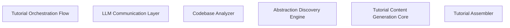

# Tutorial: tutorial-clj

## Chapters

1. [Tutorial Orchestration Flow](01_tutorial_orchestration_flow.md)
2. [Codebase Analyzer](02_codebase_analyzer.md)
3. [Abstraction Discovery Engine](03_abstraction_discovery_engine.md)
4. [Tutorial Content Generation Core](04_tutorial_content_generation_core.md)
5. [Tutorial Assembler](05_tutorial_assembler.md)
6. [LLM Communication Layer](06_llm_communication_layer.md)

---

Generated by [AI Codebase Knowledge Builder](https://github.com/The-Pocket/Tutorial-Codebase-Knowledge)