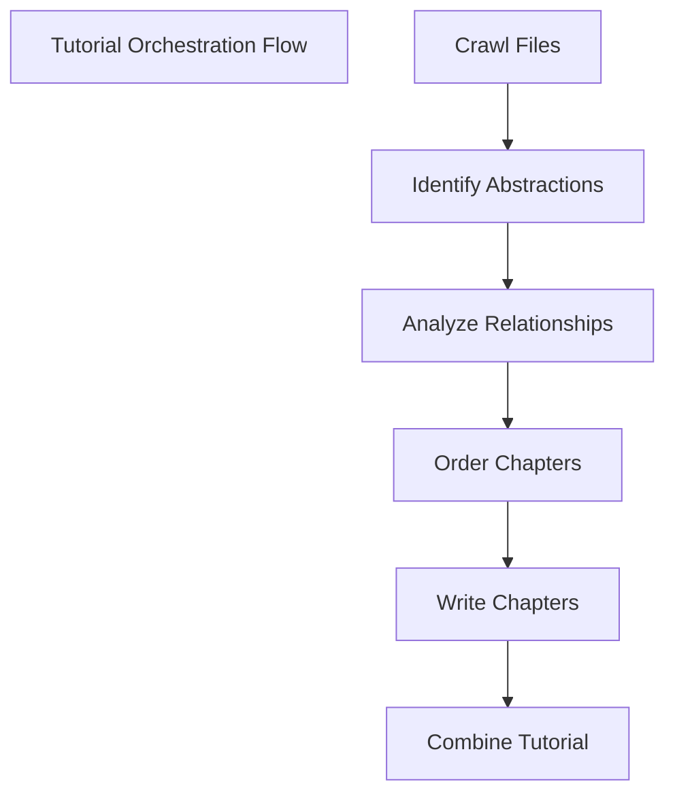

# clj-flow-agents

A Clojure implementation of AI agents using core.async flow, starting with a codebase tutorial generator.

## Overview

This project explores building AI agents using Clojure's core.async flow capabilities. The first agent implemented is a tutorial generator that analyzes codebases and creates comprehensive tutorials - a Clojure port of [PocketFlow-Tutorial-Codebase-Knowledge](https://github.com/The-Pocket/PocketFlow-Tutorial-Codebase-Knowledge).

The tutorial generator uses a flow-based architecture where each step in the tutorial creation process is handled by a separate process, connected through core.async channels:



## Setup

1. Clone the repository
2. Create a `config.properties` file in the project root with your Gemini API credentials:
```properties
gemini.api.key=your-api-key-here
```

## Usage

The tutorial generator is designed to be used from the REPL. Open `src/use_cases/tutorial.clj` and evaluate the following forms:

```clojure
;; Create and start the flow
(def f (create-tutorial-flow))
(def chs (flow/start f))

;; Trigger the tutorial generation
@(flow/inject f [:crawl-files :trigger] [{:project-name "your-project" 
                                         :language "english"
                                         :directory "."
                                         :include-patterns #{"*.clj" "*.edn"}
                                         :exclude-patterns #{".portal/*" ".git/*" "output/*"}}])

;; Monitor the flow
(flow/ping f)  ; Check overall flow status
(flow/ping-proc f :crawl-files)  ; Check specific process status

;; Optional: Start monitoring server
(def server (mon/start-server {:flow f}))
```

The generated tutorial will be created in the `output` directory.

### core.async.flow

[](https://www.youtube.com/watch?v=lXFwf3O4BVY)


## Example Generated Tutorial

You can find an example of a generated tutorial in the `.docs/tutorial-agent` directory. This tutorial was generated for this project itself, demonstrating the capabilities of the tutorial generator. The tutorial includes:

1. Tutorial Orchestration Flow
2. Codebase Analyzer
3. Abstraction Discovery Engine
4. Tutorial Content Generation Core
5. Tutorial Assembler
6. LLM Communication Layer

Check out `.docs/tutorial-agent/index.md` to see how the generator breaks down and explains a codebase's architecture.

